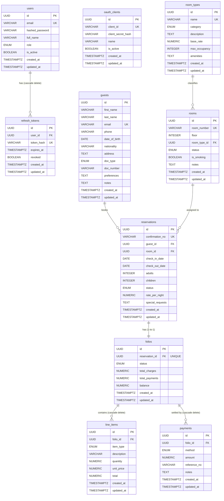

# Hotel PMS — FastAPI Boilerplate

A monolithic **Property Management System** for hotels built with FastAPI, following the MVC pattern with PostgreSQL as the data layer.

## Stack

| Layer | Technology |
|---|---|
| Framework | FastAPI (async) |
| ORM | SQLAlchemy 2.x (async) |
| Database | PostgreSQL 16 via asyncpg |
| Migrations | Alembic |
| Auth | OAuth2 Password Flow · Client Credentials · JWT (access + refresh) |
| Config | pydantic-settings |
| Testing | pytest + pytest-asyncio + factory-boy |
| Linting | ruff + mypy |

## Project Structure

```
app/
├── database/      # Engine, session factory, declarative base
├── models/        # SQLAlchemy ORM models (M in MVC)
├── schemas/       # Pydantic v2 request/response schemas (V in MVC)
├── controllers/   # Business logic layer (C in MVC)
├── routers/       # FastAPI routers — HTTP interface
├── auth/          # JWT utilities, password hashing, OAuth2 scheme
└── utils/         # Shared helpers (pagination, date math)
```

## Entity Relationship Diagram



## Domain Modules

- **Auth** — password flow, JWT access + refresh token rotation, client credentials grant for M2M
- **OAuth Clients** — registered API clients with `client_id`/`client_secret`, admin-managed
- **Users** — hotel staff with roles (admin, manager, front_desk, housekeeping)
- **Guests** — guest profiles, ID documents, preferences, stay history
- **Rooms** — room types with rates, individual rooms with status machine
- **Reservations** — availability engine, bookings, check-in/check-out lifecycle
- **Billing** — folios, line items, payments, folio statements

## Quick Start

### 1. Prerequisites
- Python 3.12+
- Docker (for PostgreSQL + pgAdmin)

### 2. Environment
```bash
cp .env.example .env
# Edit .env and set SECRET_KEY (generate with: openssl rand -hex 32)
```

### 3. Start the database
```bash
make up
# pgAdmin available at http://localhost:5050
```

### 4. Install dependencies
```bash
make install
```

### 5. Run migrations
```bash
make migrate
```

### 6. (Optional) Seed development data
```bash
make seed
```

### 7. Start the API
```bash
make dev
```

API docs: http://localhost:8000/docs

## Auth Flows

### Password grant (human users)
```bash
curl -X POST http://localhost:8000/auth/token \
  -H "Content-Type: application/x-www-form-urlencoded" \
  -d "grant_type=password&username=admin@hotel.com&password=admin123"
```

### Client credentials grant (machine-to-machine)
```bash
# 1. Register a client (admin token required)
curl -X POST http://localhost:8000/auth/clients \
  -H "Authorization: Bearer <admin_token>" \
  -H "Content-Type: application/json" \
  -d '{"name": "My Service"}'
# → returns client_id and client_secret (shown once)

# 2. Exchange credentials for an access token
curl -X POST http://localhost:8000/auth/token \
  -H "Content-Type: application/x-www-form-urlencoded" \
  -d "grant_type=client_credentials&client_id=<id>&client_secret=<secret>"
```

Client tokens carry no refresh token and bypass role checks — they have full API access.

### Use a token
```bash
curl http://localhost:8000/api/v1/rooms/ \
  -H "Authorization: Bearer <access_token>"
```

### Refresh tokens (password grant only)
```bash
curl -X POST http://localhost:8000/auth/refresh \
  -H "Content-Type: application/json" \
  -d '{"refresh_token": "<refresh_token>"}'
```

## Testing

```bash
make test
```

Integration tests require a running PostgreSQL instance (`pms_test` database). Each test runs inside a rolled-back transaction — no cleanup needed.

Coverage report is generated in `htmlcov/`.

## Code Quality

```bash
make lint     # ruff check
make format   # ruff format
```

## Adding a Migration

After modifying any model file:

```bash
make revision MSG="describe your change"
make migrate
```
